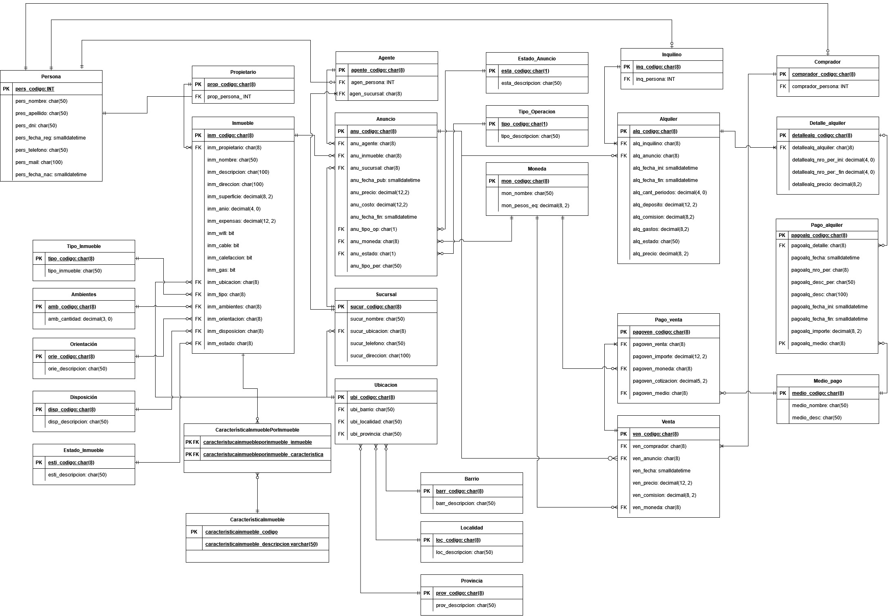

# SQLeros
[Segunda Estrategia](https://docs.google.com/document/d/1BMOj6FRZ_U0V7nN6IQMm9urdpKX5UOOV8SgKXuFxeNQ/edit?usp=sharing)

Creo que tenemos que juntar venta y alquiler en una tabla y que tipoOperacion sea una dimensión.
